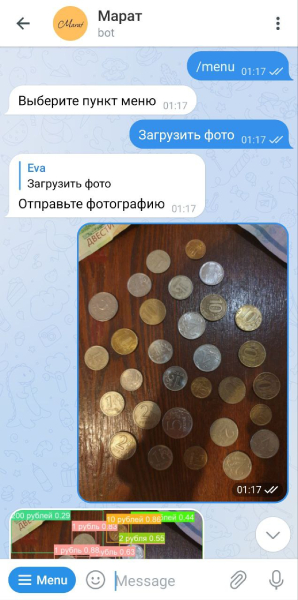
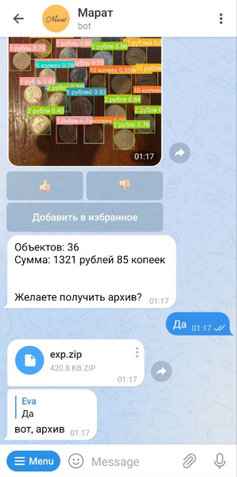

# Telegram-Bot "Марат" (eng. "Marat" )

## This app allows you:
Telegram-bot "Марат" is designed to count the number of coins and banknotes and their amounts.

You can simply send a photo of money, and then the bot will give you a response in text form, which indicates the number of 
objects and their sum!

## Appearance:

## Run:
Available here: https://t.me/money_recognizer_bot
